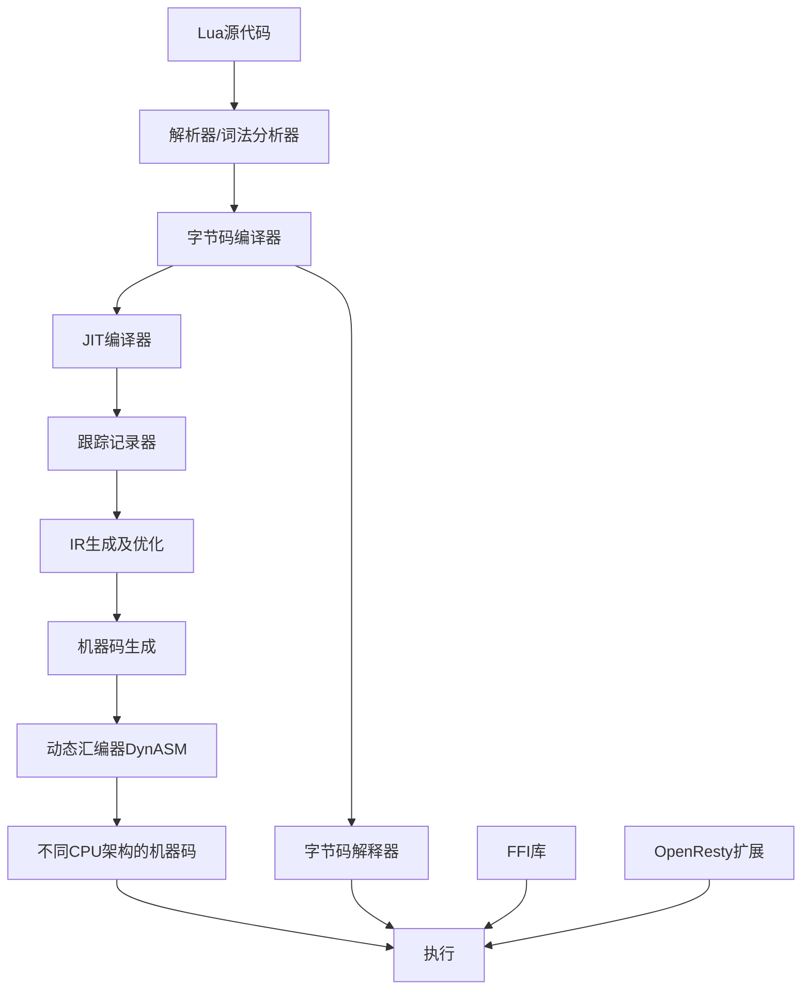

# LuaJIT2 - OpenResty维护的LuaJIT分支

## 项目简介

LuaJIT是Lua编程语言的即时编译器(JIT)。这个仓库是OpenResty官方维护的LuaJIT分支。它不是一个分叉(fork)，因为我们仍然定期从上游LuaJIT项目(https://github.com/LuaJIT/LuaJIT)同步更改。

OpenResty的LuaJIT2在原版LuaJIT的基础上引入了许多增强功能和扩展，同时保持高性能和向后兼容性。

## 目录

* [项目简介](#项目简介)
* [架构概述](#架构概述)
* [项目结构](#项目结构)
* [技术细节](#技术细节)
  * [JIT编译原理](#jit编译原理)
  * [核心组件](#核心组件)
* [性能特点](#性能特点)
* [使用示例](#使用示例)
* [OpenResty扩展](#openresty扩展)
  * [新增Lua API](#新增lua-api)
  * [新增C API](#新增c-api)
  * [优化](#优化)
* [支持的平台](#支持的平台)
* [实现Lua 5.3语法支持](#实现lua-53语法支持)
* [版权和许可](#版权和许可)

## 架构概述

LuaJIT是一个高性能的Lua实现，结合了解释器和JIT编译器。它的主要组件包括：



LuaJIT采用跟踪JIT编译技术，识别热点代码路径并将其编译为优化的机器码。动态汇编器(DynASM)负责为不同的CPU架构生成本地机器码。

## 项目结构

```
luajit2/
├── src/             # 核心源代码
│   ├── lj_*.c/h     # LuaJIT主要实现文件
│   ├── vm_*.dasc    # 虚拟机描述文件(不同架构)
│   └── luajit.c     # 命令行工具入口
├── dynasm/          # 动态汇编器
│   ├── dynasm.lua   # DynASM核心
│   └── dasm_*.lua   # 不同架构的DynASM实现
├── doc/             # 文档
├── t/               # 测试文件
├── etc/             # 配置和辅助文件
└── Makefile         # 构建系统
```

## 技术细节

### JIT编译原理

LuaJIT使用了跟踪JIT编译（Trace JIT）技术，其核心工作原理如下：

1. **热点检测**：

   - LuaJIT首先以解释器模式执行Lua代码
   - 监控执行次数，识别频繁执行的代码路径（热点）
   - 当循环或函数调用达到一定阈值时，启动JIT编译
2. **跟踪记录**：

   - 对热点代码路径开始记录执行过程
   - 生成线性执行序列（称为"trace"）
   - 记录包括类型信息和值的推测
3. **IR生成与优化**：

   - 将记录的trace转换为SSA形式的中间表示（IR）
   - 应用多种优化技术：常量折叠、公共子表达式消除、死代码消除等
   - 执行类型特化，将动态类型转换为静态类型
4. **机器码生成**：

   - 将优化后的IR转换为目标CPU架构的机器码
   - 使用DynASM动态汇编器生成高效的本地代码
   - 在运行时直接执行生成的机器码
5. **去优化处理**：

   - 当类型推测失败时，执行去优化（deoptimization）
   - 回退到解释器执行或重新编译

### 核心组件

LuaJIT由以下核心组件构成：

1. **前端编译器**：

   - 将Lua源代码解析成字节码
   - 实现了Lua 5.1语法和标准库
   - 源文件：src/lj_parse.c, src/lj_lex.c等
2. **字节码解释器**：

   - 基于寄存器的虚拟机
   - 执行编译生成的字节码
   - 源文件：src/lj_vm.h, src/vm_*.dasc等
3. **跟踪编译器**：

   - 监控代码执行，识别热点路径
   - 记录执行轨迹，生成线性trace
   - 源文件：src/lj_trace.c, src/lj_record.c等
4. **IR系统**：

   - 定义中间表示格式（SSA IR）
   - 提供IR生成和转换功能
   - 源文件：src/lj_ir.h, src/lj_ir.c等
5. **优化器**：

   - 实现多种IR优化算法
   - 包括死代码消除、常量折叠、循环优化等
   - 源文件：src/lj_opt_*.c
6. **机器码生成器**：

   - 将IR转换为机器码
   - 处理不同CPU架构的特性
   - 源文件：src/lj_mcode.c, src/lj_emit_*.c等
7. **DynASM**：

   - 动态汇编器，用于生成机器码
   - 支持多种CPU架构
   - 源文件：dynasm/dynasm.lua, dynasm/dasm_*.lua等
8. **FFI库**：

   - 外部函数接口，用于调用C函数和使用C数据结构
   - 无需编写C语言绑定
   - 源文件：src/lj_cdata.c, src/lj_cconv.c等

## 性能特点

LuaJIT在动态语言中拥有卓越的性能表现，主要特点包括：

1. **极高的执行速度**：

   - 在许多基准测试中，LuaJIT的性能接近甚至超过静态编译语言如C
   - 对于数值计算和循环密集型任务，性能提升可达10-100倍
   - 特别优化了整数和浮点数运算，接近原生速度
2. **低内存占用**：

   - 相比其他脚本语言虚拟机内存占用极低
   - 整个运行时仅需几百KB内存
   - 适合嵌入式系统和资源受限的环境
3. **快速启动**：

   - 启动时间极短，适合作为命令行工具
   - 无需预热即可获得良好性能
4. **稳定的性能表现**：

   - 峰值性能波动小，适合实时应用
   - GC暂停时间短，可用于对延迟敏感的应用
5. **高效的FFI库**：

   - 直接调用C函数几乎无开销
   - 访问C数据结构性能接近原生代码
   - 大大减少了编写绑定代码的需求

OpenResty的LuaJIT2版本在此基础上进行了进一步优化，特别是在以下方面：

- 更高效的字符串处理
- 更适合Web应用的内存管理
- 针对服务器工作负载的性能调优
- 线程数据处理的优化

## 使用示例

### 基本使用

```lua
-- hello.lua
print("Hello from LuaJIT!")

-- 显示JIT编译器状态
local jit = require("jit")
jit.status()
```

运行:

```bash
luajit hello.lua
```

### 使用FFI库调用C函数

```lua
-- ffi_example.lua
local ffi = require("ffi")

-- 声明C函数和结构体
ffi.cdef[[
typedef struct { double x, y; } point_t;

double sqrt(double x);
double hypot(double x, double y);
]]

-- 创建一个点
local point = ffi.new("point_t", 3.0, 4.0)

-- 计算到原点的距离
local distance = ffi.C.hypot(point.x, point.y)

print("距离: " .. distance)  -- 输出: 距离: 5.0
```

### 使用OpenResty扩展的table API

```lua
-- table_apis.lua
local isarray = require("table.isarray")
local isempty = require("table.isempty")
local nkeys = require("table.nkeys")
local clone = require("table.clone")

-- 测试表是否为数组
local arr = {1, 2, 3, 4, 5}
local dict = {a = 1, b = 2, c = 3}
local empty = {}

print("arr是数组: " .. tostring(isarray(arr)))      -- 输出: true
print("dict是数组: " .. tostring(isarray(dict)))    -- 输出: false
print("empty是数组: " .. tostring(isarray(empty)))  -- 输出: true (空表被视为数组)

-- 测试表是否为空
print("empty是空的: " .. tostring(isempty(empty)))  -- 输出: true
print("arr是空的: " .. tostring(isempty(arr)))      -- 输出: false

-- 计算表中的键数量
print("dict中的键数量: " .. nkeys(dict))            -- 输出: 3

-- 克隆表
local arr_clone = clone(arr)
arr[1] = 100
print("原数组第一个元素: " .. arr[1])               -- 输出: 100
print("克隆数组第一个元素: " .. arr_clone[1])       -- 输出: 1
```

### 控制JIT编译器

```lua
-- jit_control.lua
local jit = require("jit")

-- 显示JIT状态
jit.status()

-- 禁用JIT编译
jit.off()

-- 对特定函数启用JIT编译
jit.on()

-- 转储JIT编译信息
jit.dump_start("jit.log")

-- 计算斐波那契数列 (会被JIT编译)
local function fib(n)
    if n <= 1 then return n end
    return fib(n-1) + fib(n-2)
end

print("fib(30) = " .. fib(30))

jit.dump_stop()
```

## OpenResty扩展

OpenResty对LuaJIT进行了多项扩展和改进，包括新的API、优化以及一些有用的调试功能。

### 新增Lua API

* **table.isempty**: 检查表是否为空
* **table.isarray**: 检查表是否为纯数组
* **table.nkeys**: 计算表中的键数量
* **table.clone**: 创建表的浅拷贝
* **jit.prngstate**: 获取/设置JIT编译器的PRNG状态
* **thread.exdata/exdata2**: 线程数据的存储和获取

### 新增C API

* **lua_setexdata/lua_getexdata**: 设置/获取额外的用户数据指针
* **lua_setexdata2/lua_getexdata2**: 设置/获取第二个用户数据指针
* **lua_resetthread**: 重置Lua线程状态

### 优化

* 更积极的JIT编译器默认选项，提高大型应用性能
* 针对Intel CPU优化的字符串哈希实现(使用SSE 4.2)
* 改进的字节码选项，便于调试和分析
* 将允许的upvalue数量从60增加到120
* 多项JIT编译器和Lua VM的重要bug修复

## 支持的平台

LuaJIT支持多种操作系统和CPU架构：

* **操作系统**: Windows, Linux, BSD, macOS, Android, iOS, PS3/PS4/PS5, Xbox, Nintendo Switch等
* **CPU架构**: x86/x64, ARM/ARM64, PPC, MIPS32/MIPS64, s390x

## 实现Lua 5.3语法支持

LuaJIT当前基于Lua 5.1的语法和标准库，如果要增加对Lua 5.3语法的支持，需要修改以下组件：

### 需要修改的核心组件

1. **词法分析器 (src/lj_lex.c, src/lj_lex.h)**
   - 添加新的词法标记，如整数除法操作符 (`//`)
   - 扩展数值字面量解析，支持Lua 5.3的十六进制浮点数字面量
   - 添加对新的位运算符的支持 (`&`, `|`, `~`, `>>`, `<<`, `~`)

2. **语法解析器 (src/lj_parse.c)**
   - 更新语法规则以支持新的运算符和表达式
   - 实现对新语法结构的解析
   - 修改表达式解析逻辑以处理位运算和整数除法

3. **字节码生成 (src/lj_bc.h, src/lj_bcwrite.c)**
   - 增加新的字节码指令，支持Lua 5.3的操作
   - 扩展现有指令集以处理新的操作符

4. **虚拟机解释器 (src/lj_vm.h, src/vm_*.dasc)**
   - 在各个架构的VM描述文件中实现新的字节码指令处理
   - 修改数值操作逻辑，增加对原生64位整数的支持
   - 实现位运算和整数除法的VM处理逻辑

5. **JIT编译器**
   - 在IR系统中添加新的操作 (src/lj_ir.h)
   - 扩展记录和快照机制以支持新类型 (src/lj_record.c)
   - 为新的操作实现优化规则 (src/lj_opt_*.c)
   - 更新机器码生成，支持位运算和整数操作 (src/lj_emit_*.c)

6. **标准库**
   - 实现UTF-8库 (可以创建新文件如src/lj_utf8.c)
   - 扩展基础库以包含Lua 5.3中的新函数
   - 更新表处理库以符合Lua 5.3的表长度规则

### 主要实现挑战

1. **64位整数支持**
   - LuaJIT当前使用双精度浮点数表示所有数值
   - 需要修改内部类型系统以区分整数和浮点数
   - 需要考虑整数运算的溢出处理
   - 在src/lj_obj.h中修改数值类型定义

2. **维持性能**
   - 确保新添加的功能不会降低JIT编译器的性能
   - 可能需要为新操作开发特定的优化规则
   - 需要对JIT编译器进行全面测试

3. **跟踪类型系统的改变**
   - 跟踪编译器依赖于类型推断和特化
   - 添加新类型时需要更新所有类型相关的逻辑

4. **向后兼容性**
   - 确保现有Lua 5.1代码仍能正常工作
   - 考虑添加配置选项来启用/禁用Lua 5.3语法

### 实现路径建议

1. **增量实现**
   - 从基本功能开始，如位运算库
   - 逐步添加更复杂的功能，如64位整数支持
   - 每个阶段都进行全面测试

2. **借鉴已有实现**
   - 研究其他尝试将Lua 5.3功能添加到LuaJIT的项目
   - 可以参考已有补丁和fork以了解潜在问题

3. **考虑替代方案**
   - 对于某些功能，可以使用库替代而不是修改核心
   - 例如，bit操作可以通过现有的bit库提供，而不需要新语法

### 测试和验证

1. **创建测试套件**
   - 编写覆盖所有新语法和功能的测试用例
   - 确保与Lua 5.3官方测试套件兼容

2. **性能基准测试**
   - 评估对JIT编译性能的影响
   - 与标准Lua 5.3和原始LuaJIT比较性能

3. **兼容性检查**
   - 测试现有Lua 5.1代码的兼容性
   - 验证OpenResty相关模块的兼容性

实现Lua 5.3语法支持是一项重大工作，需要深入了解LuaJIT的内部结构和Lua语言规范。建议首先创建一个实验性分支进行开发，并寻求社区的反馈和贡献。

## 版权和许可

LuaJIT是Mike Pall的版权作品 (C) 2005-2025，使用MIT许可证发布。

OpenResty的补丁版权归张亦春和OpenResty Inc所有：

- 版权所有 (C) 2017-2019 张亦春。保留所有权利。
- 版权所有 (C) 2017-2019 OpenResty Inc。保留所有权利。

LuaJIT是自由软件，基于MIT许可证发布。
